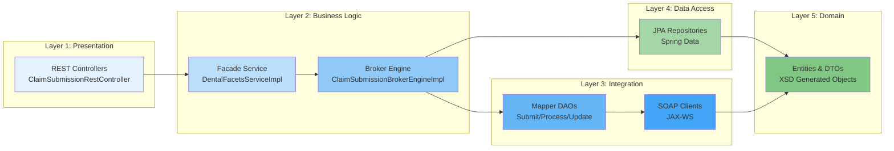
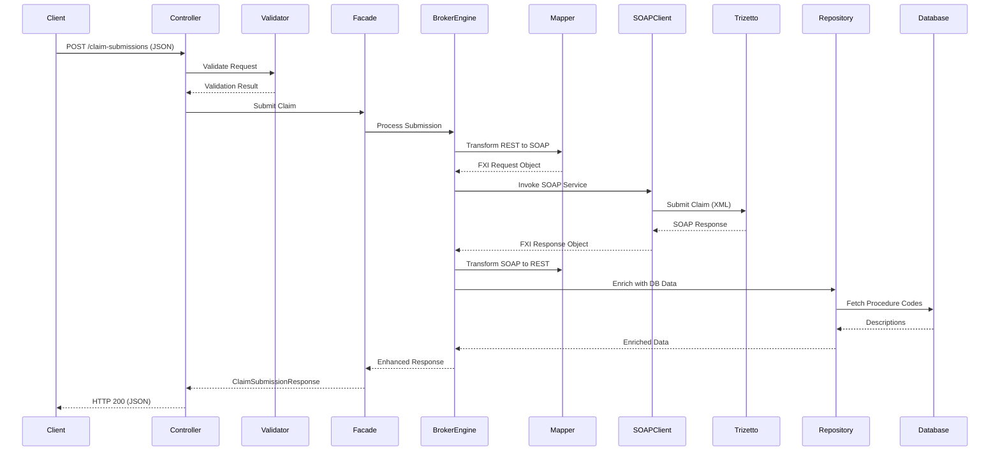
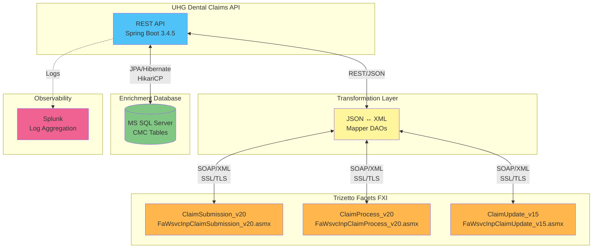
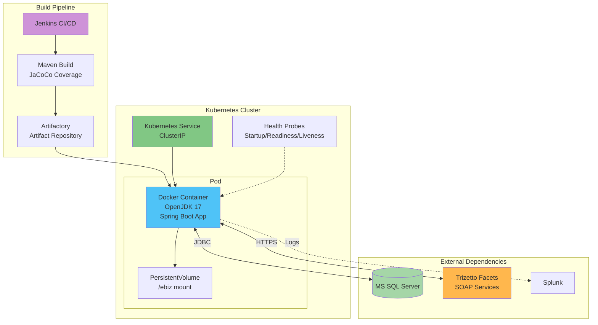
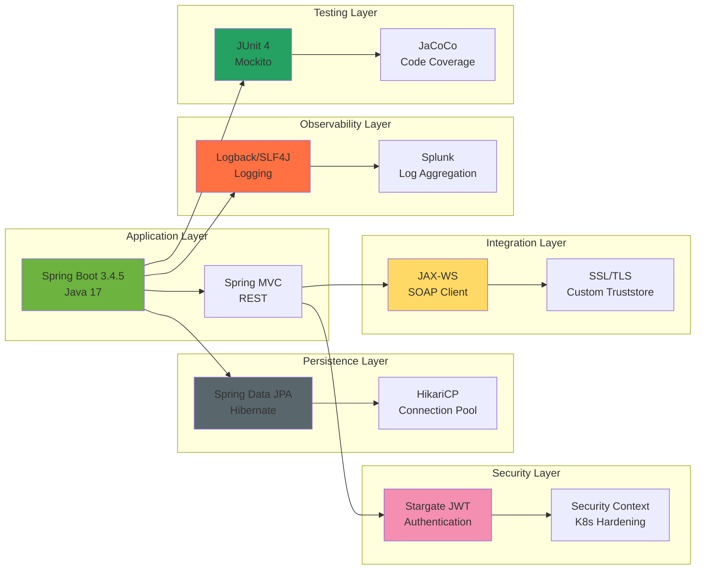
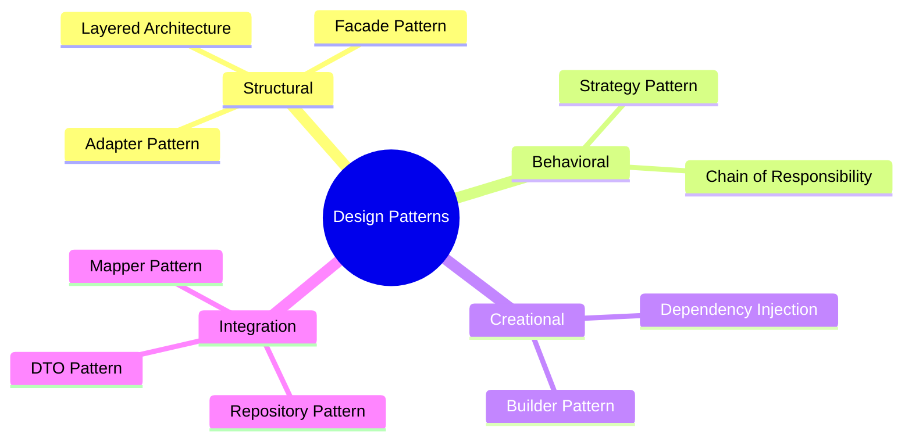

# Dental Claims Processing System - Architecture Diagram

## High-Level Architecture Overview

```mermaid
graph TB
    subgraph "Client Layer"
        CLIENT[REST Client]
    end

    subgraph "Security & Filtering Layer"
        HEALTH[Health Check Filter]
        JWT[Stargate JWT Filter]
    end

    subgraph "Presentation Layer"
        CONTROLLER[ClaimSubmissionRestController<br/>POST /claim-submissions<br/>PUT /prices<br/>PUT /{claimId}]
    end

    subgraph "Service Layer"
        VALIDATOR[Request Validator]
        FACADE[DentalFacetsService<br/>Facade Pattern]
        BROKER[ClaimSubmissionBrokerEngine<br/>Integration Orchestrator]
    end

    subgraph "Data Transformation Layer"
        MAPPER1[ClaimSubmission<br/>MapperDao]
        MAPPER2[ClaimProcess<br/>MapperDao]
        MAPPER3[ClaimUpdate<br/>MapperDao]
    end

    subgraph "External Integration Layer"
        SOAP1[ClaimSubmission_v20<br/>SOAP Service]
        SOAP2[ClaimProcess_v20<br/>SOAP Service]
        SOAP3[ClaimUpdate_v15<br/>SOAP Service]
    end

    subgraph "Data Access Layer"
        REPO1[DisallowExplanation<br/>Repository]
        REPO2[ProcedureCode<br/>Repository]
    end

    subgraph "Data Layer"
        DB[(MS SQL Server<br/>CMC_EXCD_EXPL_CD<br/>CMC_DPDS_DESC)]
    end

    subgraph "Cross-Cutting Concerns"
        LOGGING[Logging Service<br/>+ Splunk Integration]
        EXCEPTION[Global Exception<br/>Handler]
    end

    subgraph "External Systems"
        TRIZETTO[Trizetto Facets FXI<br/>Legacy SOAP Services]
    end

    CLIENT -->|HTTPS/JSON| HEALTH
    HEALTH --> JWT
    JWT -->|Authenticated| CONTROLLER
    CONTROLLER --> VALIDATOR
    VALIDATOR -->|Valid Request| FACADE
    FACADE --> BROKER

    BROKER --> MAPPER1
    BROKER --> MAPPER2
    BROKER --> MAPPER3

    MAPPER1 -->|REST to SOAP| SOAP1
    MAPPER2 -->|REST to SOAP| SOAP2
    MAPPER3 -->|REST to SOAP| SOAP3

    SOAP1 -->|JAX-WS/SSL| TRIZETTO
    SOAP2 -->|JAX-WS/SSL| TRIZETTO
    SOAP3 -->|JAX-WS/SSL| TRIZETTO

    TRIZETTO -->|SOAP Response| SOAP1
    TRIZETTO -->|SOAP Response| SOAP2
    TRIZETTO -->|SOAP Response| SOAP3

    BROKER --> REPO1
    BROKER --> REPO2

    REPO1 -->|JPA/Hibernate| DB
    REPO2 -->|JPA/Hibernate| DB

    CONTROLLER -.->|Logs| LOGGING
    BROKER -.->|Logs| LOGGING
    CONTROLLER -.->|Errors| EXCEPTION
    BROKER -.->|Errors| EXCEPTION

    LOGGING -.->|Aggregates| SPLUNK[Splunk]

    style CLIENT fill:#e1f5ff
    style CONTROLLER fill:#bbdefb
    style FACADE fill:#90caf9
    style BROKER fill:#64b5f6
    style TRIZETTO fill:#fff9c4
    style DB fill:#c8e6c9
    style LOGGING fill:#ffccbc
    style EXCEPTION fill:#ffccbc
    style JWT fill:#f8bbd0
```

## Detailed Layered Architecture



## Data Flow Diagram



## Integration Architecture



## Deployment Architecture



## Technology Stack



## Design Patterns Used



## Key Architectural Characteristics

| Characteristic | Implementation |
|---|---|
| **Scalability** | Stateless design, Kubernetes deployment, connection pooling |
| **Security** | JWT authentication, SSL/TLS, security context hardening |
| **Reliability** | Comprehensive error handling, health checks, validation |
| **Observability** | Multi-level logging, Splunk integration, request/response tracing |
| **Maintainability** | Clear layer separation, dependency injection, interface-based design |
| **Performance** | HikariCP connection pooling, efficient data enrichment |
| **Integration** | Adapter pattern for SOAP integration, flexible transformation layer |

---

**Architecture Style:** Layered/N-Tier with Service-Oriented Architecture (SOA)
**Framework:** Spring Boot 3.4.5 (Java 17)
**Deployment:** Kubernetes + Docker
**Primary Use Case:** Dental Claims Processing & Integration with Legacy SOAP Systems
